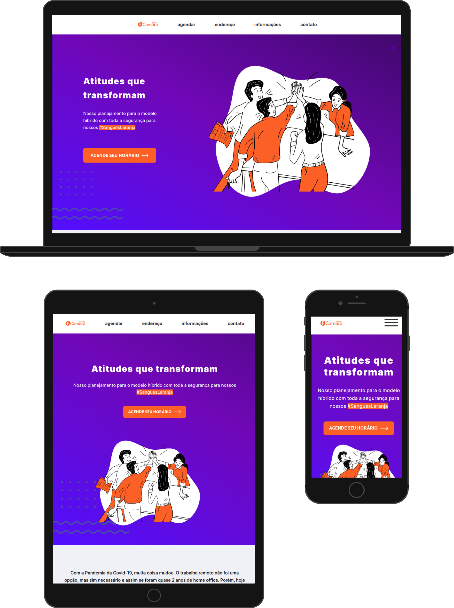

# FCamara Landing Page - Modelo Híbrido

<table>
<tr>
<td>
	A FCamara, premiada empresa do segmento de tecnologia do Brasil implementará um modelo híbrido para seus consultores e consultoras. A proposta procura, por meio de agendamento, organizar a volta ao trabalho presencial de parte da equipe. 
	A criação de uma Landing Page se fez necessária para agregar informações pertinentes ao modelo híbrido.
</td>
</tr>
</table>

## Site

### Landing Page

Construída com html / css / javascript 
Link para acesso : <https://gabrielasertori.github.io/FCamara-landing-page/> 

## Mobile

A Landing Page tem todo suporte para celulares até 350px de largura

## Desenvolvimento

A documentação de todo o processo do projeto:

[Mural](https://app.mural.co/t/fcamaramural4882/m/fcamaramural4882/1632940587550/82b9f6a061252331f41408181a98af00f26bddad?sender=u3baf90102716c75e0b3a5714)

Mural é um software que permite a criação de um whiteboard online para brainstorm. 
No meu trabalho, usei para brainstorm, benchmark, pesquisa de referências, organização de informações e para mapear o fluxo no site pelos usuários 

[Figma](https://www.figma.com/file/Vwk9u7igeTGuC4Id1Hnzhs/Design-system-FCamara?node-id=0%3A1)

Figma é um editor online que permite fácil criação de um design system e prototipagens de baixa e alta fidelidade. 
No projeto pode-se conferir mais de uma página, as quais contém a organização do design system, icones, imagens, do conteúdo do site e protótipos 

[Trello](https://trello.com/invite/b/S5xsZHij/02d098543c0087558d29e634c7e3532e/fcamara-kanban)

Trello é uma ferramenta de organização online 
Aqui, usei como kanban para me auxiliar a visualizar as ações a serem feitas, fazendo e concluídas. 

[Notion](https://telling-index-1f4.notion.site/41672788bb884addb1f47f691f164305?v=984a5d519d5c4e64902db77f8af3b774)

Notion é um software online que age como um caderno de anotações robusto. 
No projeto usei uma tabela para registrar as impressões dos usuários após o teste de usabilidade 

### Bug / Sugestões

Se você achou um bug (resultados inesperados acontecem ao abrir ou interagir com a página), por favor abra uma issue com o título #Bug [aqui](https://github.com/gabrielasertori/FCamara-landing-page/issues) e inclua o que está acontecendo.

Se você gostaria de dar alguma sugestão, algo que esqueci de observar, por favor, abra uma issue com o título #Sugestão [aqui](https://github.com/gabrielasertori/FCamara-landing-page/issues).

## Feito com

- [Javascript](https://developer.mozilla.org/en-US/docs/Web/javascript).
- [CSS](https://developer.mozilla.org/en-US/docs/Web/CSS).
- [Html](https://developer.mozilla.org/en-US/docs/Web/HTML).

[Licença-MIT](https://choosealicense.com/licenses/mit/)
